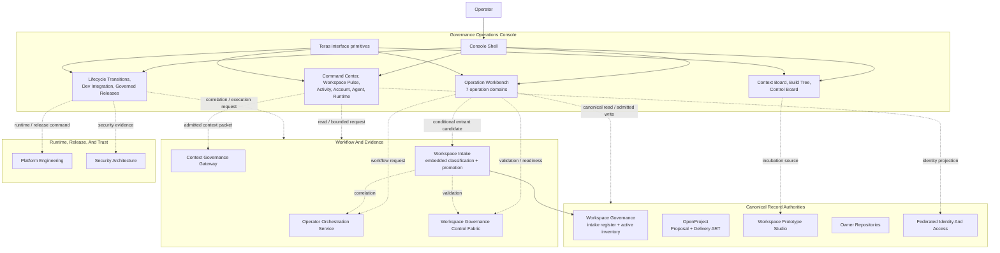

# System Context

Status: approved pre-baseline target projection.

Source: [`system-model.yaml`](../system-model.yaml). This view does not define
independent architecture truth.

## System Role

The Governance Operations Console is an operator and command surface over
multiple canonical authorities. It composes projections, prepares bounded
commands, routes operators to owning workflows, and reconciles receipts. It
does not become a canonical business database or a replacement control plane.

## Architectural Planes

| Plane | Responsibility |
| --- | --- |
| Operator experience | Shell, navigation, dashboards, focused workspaces, dialogs, and bounded assistance. |
| Domain operations | Proposal, Repository, Model, Delivery, Prototype, Portfolio, and Orchestration behavior. |
| Cross-domain control | Transition correlation, environment operations, attention routing, and read-only runtime posture. |
| Governance evidence | Policy, validation planning, readiness, context admission, receipts, and security decisions. |
| Workflow execution | Shared operator APIs, adapters, retry, correlation, and future durable execution. |
| Canonical authority | Durable proposal, delivery, prototype, product, repository, source, identity, and platform records. |
| Runtime and release | Local integration, stage, production, product runtime, and release execution. |
| Interface infrastructure | Product-neutral primitives and reusable incubating product applications. |

## Boundary Rules

- The Console has no canonical business database.
- Console-local drafts and receipts prove interaction, not backend mutation.
- Each canonical record has one authority and one mutation owner.
- The Console must identify stale, unverified, unavailable, and
  prototype-local data explicitly.
- Missing backend support is an implementation gap. It does not invalidate an
  approved target capability or permit a fake live effect.
- Workspace Intake is a generic Workspace Governance authority workflow for
  repos, products, and components. It is embedded where an entrant is
  discovered and is not an Operation Workbench domain.
- `admitted` in the intake register means accepted for governance
  consideration. Only a separate promotion creates an active `repos.yaml`,
  `products.yaml`, or `components.yaml` record.
- Cross-repo implementation begins only after baseline approval and is routed
  to the owner that must review, deploy, validate, and roll it back.
