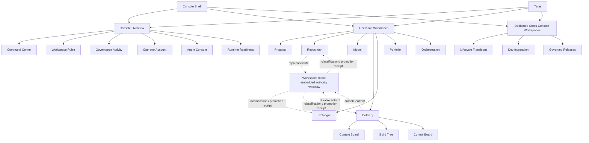

# Operator Surface Map

Status: approved pre-baseline target projection.

Source: [`system-model.yaml`](../system-model.yaml). This view describes
operator entry and composition; it does not redefine domain ownership.

## Surface Families

| Surface family | Members | Operator purpose | Explicit boundary |
| --- | --- | --- | --- |
| Console overview | Command Center, Workspace Pulse, Governance Activity, Operator Account, Agent Console, Runtime Readiness | Orient, inspect, and route attention across the system. | Does not execute domain work or own source history. |
| Operation Workbench | Proposal, Repository, Model, Delivery, Prototype, Portfolio, Orchestration | Enter one domain-owned control surface with its register, dashboard, workflow, and history shapes as required. | The Workbench host owns selection and mounting only. |
| Dedicated workspaces | Lifecycle Transitions, Dev Integration, Governed Releases | Handle large cross-domain or environment concerns that would overload the overview. | They project owner state and route commands; they do not acquire owner authority. |
| Embedded authority workflows | Workspace Intake classification and active-inventory promotion | Let the originating workflow submit a generic repo, product, or component candidate and reconcile the Workspace Governance receipt. | No standalone Product Intake operation; direct or unresolved entrants may justify a future generic queue. |
| Incubating product apps | Context Board, Build Tree, Control Board | Supply reusable authoring and projection behavior consumed first by Delivery. | They remain product-neutral and do not own Delivery semantics. |
| Interface infrastructure | Teras | Supply neutral primitives and composition grammar. | It contains no domain language, lifecycle, or business behavior. |

## Direct Entry Rule

- Every operation domain can be opened directly from the persistent Console
  navigation and from the Operation Workbench overview.
- Direct entry changes presentation context only. It does not skip a domain
  gate, create a record, or imply workflow completion.
- A dashboard is a stable record-oriented control surface. A workflow is a
  bounded mutation or decision path. A history view is an immutable projection.
  These roles must not be mixed.
- Lifecycle Transitions, Dev Integration, and Governed Releases are first-class
  workspaces because their registers and controls need more room than the main
  Console panel can safely provide.
- Workspace Intake is not direct Workbench navigation. Its operator decision
  appears in the workflow that discovered the entrant, while Orchestration may
  expose only the technical run when durable execution is required.

## Composition Rule

Operation domains may use different workflows because their business jobs
differ. They still share the same structural grammar:

1. Source-qualified register or entry.
2. Stable selected-record or dashboard context.
3. Explicit workflow entry for real mutation.
4. State derived from one domain read model.
5. Receipts and history separated from current action.
6. Teras primitives for all shared presentation behavior.

No surface creates local styling or a new shared component without a reviewed,
product-neutral gap in Teras.
