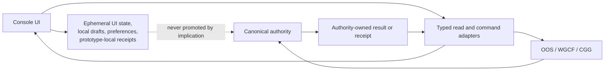

# Authority Map

Status: approved pre-baseline target projection.

Source: [`system-model.yaml`](../system-model.yaml). Authority ownership in the
model takes precedence over convenience in the Console implementation.

## Read And Command Boundary

## Canonical Authorities

| Authority | Owns | Console posture |
| --- | --- | --- |
| Workspace Governance | Workspace contracts, controlled vocabulary, repo and product inventory, intake decisions, routing rules. | Read projections and submit admitted requests. |
| Workspace Governance Control Fabric | Governance graph, validation planning, readiness, receipts, and ledger runtime. | Request evaluation and display receipts; never replace policy authority. |
| Operator Orchestration Service | Shared workflow APIs, OpenProject adapters, correlation, audit, and bounded run control. | Submit commands and reconcile operation state. |
| OpenProject | Canonical Proposal records and Workspace Delivery ART work state. | Read and mutate only through admitted workflow adapters. |
| Workspace Prototype Studio | Prototype registry, lifecycle records, design baselines, graduation records, and pre-graduation source. | Own the current prototype model and later expose a typed adapter. |
| Platform Engineering | Dev-integration runner, environment contracts, Argo state, stage, production, product integration, and release execution. | Observe capabilities and request supported operations. |
| Security Architecture | Trust standards, findings, review, acceptance, and security exception decisions. | Display evidence and route explicit decision requests. |
| Context Governance Gateway | Capture, normalization, redaction, budgeting, safe packets, context receipts, and its ledger. | Request context admission; consume safe packets and references only. |
| Owner repositories | Durable product and component source, manifests, behavior, and source evidence. | Link source truth; never copy it into a Console database. |
| Federated Identity and Access | Authentication, sessions, role mapping, named authority, access requests, and enforcement. | Project identity and submit access requests; local preferences remain separate. |

## Domain To Authority Map

| Domain | Primary authority set |
| --- | --- |
| Proposal | OOS and OpenProject |
| Repository | Workspace Governance and owner repositories |
| Model Operations | Platform Engineering, Security Architecture, and OOS |
| Delivery | OOS, OpenProject, and WGCF |
| Prototype | Workspace Prototype Studio, with Platform and Security evidence |
| Product Portfolio | Workspace Governance, owner manifests, Platform, Security, WGCF, and Delivery evidence |
| Orchestration | OOS, with source in owner repositories and Platform/Security admission |

## Workspace Intake Authority Workflow

Workspace Intake is not an Operation Workbench domain. Workspace Governance
owns both canonical layers:

| Layer | Canonical record | Meaning |
| --- | --- | --- |
| Intake classification | `contracts/intake-register.yaml` | Explicit `out-of-scope`, `proposed`, or `admitted` decision for a repository, product, or component that is not active inventory. |
| Active inventory promotion | `contracts/repos.yaml`, `contracts/products.yaml`, or `contracts/components.yaml` | Type-specific promotion after an admitted entrant satisfies active-governance requirements. |

OOS may correlate the workflow and WGCF may evaluate requirements. Neither
service owns the decision or the canonical contract mutation. The originating
operation presents the candidate and reconciles the returned receipt.

## Mutation Contract

Every live mutable command must carry:

1. Authenticated actor and named authority.
2. Canonical source id and expected source version.
3. Idempotency key and correlation id.
4. Typed request body and explicit target operation.
5. Server-side validation and authorization.
6. Authority-owned mutation or an explicit rejection.
7. Reconciled result or receipt returned to the read model.

The Console must fail closed when actor authority, source freshness, backend
capability, or receipt reconciliation is unavailable.
