# End-To-End Lifecycle

Status: approved pre-baseline target projection.

Source: [`system-model.yaml`](../system-model.yaml). Domain contracts may add
local steps, but they must preserve this cross-domain custody model.

## Work And Product Lifecycle

```mermaid
flowchart LR
  Ingress["Operator, API, agent,<br/>or system ingress"] --> Proposal["Proposal"]
  Proposal --> Triage["Triage"]
  Triage --> Decision{"Disposition"}
  Decision -->|park| Parked["Parked"]
  Decision -->|reject| Rejected["Rejected"]
  Decision -->|accept| Route{"Target intent"}

  Route --> RepoGate{"Source custody clear?"}
  RepoGate -->|new or unclear| Repository["Repository request<br/>and provisioning"]
  RepoGate -->|yes| Target{"Delivery or Prototype"}

  Target -->|Delivery| DeliveryIngress["Delivery ingress receipt"]
  Target -->|Prototype| PrototypeIngress["Prototype application receipt"]

  DeliveryIngress --> Intake["Delivery Intake"]
  Intake --> WorkDesign["Work Design"]
  WorkDesign --> Refinement["Refinement"]
  Refinement --> Execution["Execution"]
  Execution --> Closeout{"Delivery closeout"}

  PrototypeIngress --> Exploring["Exploring"]
  Exploring --> Candidate["Candidate"]
  Candidate --> Baseline["Baseline approved"]
  Baseline --> Graduating["Graduating"]
  Graduating --> DeliveryIngress
  DeliveryIngress -. "final consume receipt" .-> Graduated["Prototype graduated"]

  Closeout --> DeliveryHistory["Delivery history"]
  Closeout -. "existing active product impact evidence" .-> ProductUpdate["Product-owner update packet"]

  Repository -. "new repo candidate" .-> WorkspaceIntake["Workspace Intake classification"]
  Baseline -. "new repo, product, or component" .-> WorkspaceIntake
  Closeout -. "new repo, product, or component" .-> WorkspaceIntake
  WorkspaceIntake --> IntakeDecision{"out-of-scope,<br/>proposed, or admitted"}
  IntakeDecision -->|admitted + ready| Promotion["Active inventory promotion"]
  Promotion --> ActiveInventory["repos.yaml, products.yaml,<br/>or components.yaml"]
  ActiveInventory -. "active repo resolves custody" .-> RepoGate

  ActiveInventory -->|active product + owner packet<br/>+ operating evidence| Publication["Portfolio publication validation"]
  ProductUpdate --> Publication
  Publication --> Portfolio["Product Portfolio listing"]
```

## Custody Rules

- Proposal owns idea intake, triage, disposition, and target intent.
- Repository resolves source custody as a supporting gate. It is not a work
  destination.
- Delivery ingress creates a `needs-consume` Intake source. Delivery then owns
  governed work design, refinement, execution, and closeout.
- Every accepted Delivery closeout creates Delivery history. Product impact is
  an optional typed output of that same closeout, not an alternative to
  history.
- Prototype ingress creates an `exploring` record with Landing still required.
  Prototype owns incubation through baseline approval and graduation intent.
- A Prototype graduates only after Delivery Consume returns the final shell,
  backlink, and source-custody receipt.
- Workspace Intake classifies newly discovered repositories, products, and
  components. `admitted` does not place the entrant in active inventory.
- Active-inventory promotion is a separate Workspace Governance change that
  removes the intake entry and adds exactly one active contract record.
- Portfolio validates and curates publication of an active real product with
  product-owner and operating evidence. It does not create the product, promote
  intake entries, or grant runtime access.
- Delivery may identify an existing-product change and retain the active
  product ref with its outcome evidence. The product owner assembles the full
  versioned publication packet consumed by Portfolio.
- Proposal and Prototype do not route directly to Portfolio.

## State Separation

The following state families are independent:

| State family | Meaning |
| --- | --- |
| Proposal lifecycle | `captured`, `triaged`, `parked`, `owner-assigned`, `accepted`, `rejected`, `implemented`, `superseded`. |
| Target handoff | Packet preparation, validation, target admission, execution, and receipt reconciliation. |
| Prototype lifecycle | `exploring`, `candidate`, `baseline-approved`, `graduating`, `graduated`, `retired`. |
| Delivery intake | `needs-consume`, `consume-failed`, `consumed`. |
| Workspace intake classification | `out-of-scope`, `proposed`, `admitted`; none is active inventory. |
| Workspace active inventory | Presence in exactly one of `repos.yaml`, `products.yaml`, or `components.yaml`. |
| Portfolio listing | `listed`, `unlisted`, `retired`. |
| Source freshness | `current`, `stale`, `unverified`, `unavailable`. |

An accepted Proposal remains accepted when Delivery or Prototype accepts target
ingress. The Proposal becomes `implemented` only when downstream completion
evidence is reconciled. Target ingress, intake classification, active inventory,
handoff success, lifecycle completion, runtime availability, and Portfolio
listing are never aliases.

## Correction And Failure

- Source validation failure returns the packet to the source owner.
- Target rejection produces a target-owned rejection receipt.
- Technical execution failure remains a command or transition failure and does
  not rewrite the business lifecycle into an invented domain state.
- A missing adapter is displayed as unavailable or prototype-local. It is not a
  successful transition.
