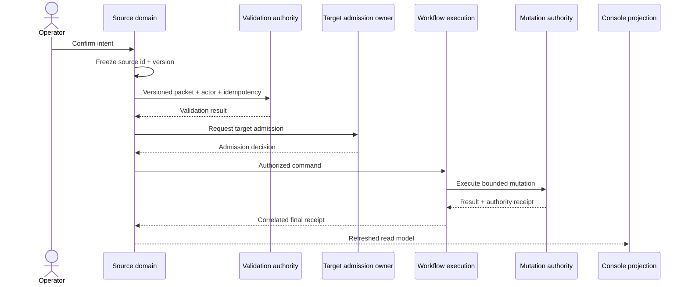

# Handoff And Transition Map

Status: approved pre-baseline target projection.

Source: [`system-model.yaml`](../system-model.yaml). Every row below maps to one
transition id in that model.

## Standard Transition Protocol

A transition may stop after validation, admission, or rejection. Only an
authority-owned result and reconciled receipt permit the Console to project
application or completion.

## Domain Handoffs

| Transition | Trigger and target completion | Console | Backend | Adapter |
| --- | --- | --- | --- | --- |
| Proposal to Delivery | Accepted Proposal selects Delivery; a Delivery ingress receipt creates an Intake source while Proposal remains accepted. | prototype-only | implemented | missing |
| Proposal to Prototype | Accepted Proposal selects exploration; a Prototype receipt creates an `exploring` record with Landing required. | prototype-only | missing | missing |
| Proposal Repository Gate | Selected route needs new or clarified source custody; an active workspace repository ref returns control to Proposal handoff. | prototype-only | missing | missing |
| Repository Request and Provisioning | Operator or upstream domain requests durable source; physical repository, ownership, README, and AGENTS evidence reconcile without implying workspace classification. | prototype-only | partial | missing |
| Prototype to Delivery | Baseline-approved Prototype prepares graduation; Delivery Consume creates or reuses the ART shell and final receipt marks graduation. | prototype-only | missing | missing |
| Delivery Owner Repo Catalog Link | Active Delivery needs an active workspace repo as `Owner Repo`; catalog add, link, sync, and work-item update reconcile. | prototype-only | partial | missing |
| Repository to Workspace Intake | A provisioned repo emits a generic entrant packet; Workspace Governance records one explicit intake classification without creating active inventory. | not-started | partial | missing |
| Prototype to Workspace Intake | Prototype establishes a new durable repo, product, or component boundary; the originating workflow submits a generic entrant packet. | not-started | partial | missing |
| Delivery to Workspace Intake | Delivery discovers a new durable repo, product, or component boundary; the originating workflow submits a generic entrant packet. | partial | partial | missing |
| Workspace Intake to Active Inventory | An admitted entrant satisfies type-specific requirements; one governed change removes it from intake and adds it to exactly one active inventory contract. | partial | partial | missing |
| Active Product to Portfolio | An active `products.yaml` product has a product-owner publication packet and operating evidence; Portfolio projects one policy-permitted listing. | prototype-only | missing | missing |
| Existing Product Update to Portfolio | Delivery closeout or a release produces outcome evidence against an active product ref; the product owner assembles the versioned publication packet and the existing listing updates without duplicate identity. | partial | missing | missing |

## Workspace Intake Split

```mermaid
flowchart LR
  Candidate["Originating workflow<br/>generic entrant packet"]
  Classification["Workspace Intake classification"]
  Register["intake-register.yaml"]
  Promotion["Active inventory promotion"]
  Inventory["repos.yaml / products.yaml / components.yaml"]

  Candidate --> Classification
  Classification -->|out-of-scope / proposed / admitted| Register
  Register -->|admitted + type-specific readiness| Promotion
  Promotion -->|remove intake + add one active record| Inventory
```

Classification and promotion are separate workflows and receipts. A
classification receipt cannot satisfy an active-inventory requirement.

## Operational Handoffs

| Transition | Trigger and target completion | Console | Backend | Adapter |
| --- | --- | --- | --- | --- |
| Model Profile Request | Operator requests creation or lifecycle change; source-backed registry, access, OOS, and Security evidence reconcile. | not-started | missing | missing |
| Orchestration Definition Admission | Reviewed executable source is ready; OOS exposes one immutable active definition version. | prototype-only | missing | missing |
| Durable Orchestration Run | Approved domain command matches an active definition; a durable adapter returns a reconciled final receipt. | prototype-only | missing | missing |
| Dev Integration Profile Request | Component needs a fast integration lane; admitted active profile and owner commands exist without implying stage. | prototype-only | partial | missing |
| Governed Product Release | Product descriptor permits an operation; Platform and product projections reconcile with an immutable receipt. | prototype-only | partial | missing |
| Governed Context to Agent | Context candidate is admitted; Agent Console receives only a model-safe packet and receipt references. | partial | partial | missing |

## Ownership Pattern

| Concern | Default owner |
| --- | --- |
| Source packet and correction | Source domain authority |
| Policy and readiness evaluation | WGCF or the named governing authority |
| Target admission | Target domain authority |
| Workflow correlation and bounded retry | OOS, except CGG-owned context admission |
| Canonical mutation | Authority named by the target record |
| Final receipt | Execution or target authority named in the transition |
| Operator projection | Console read model, derived from the above |

Lifecycle Transitions projects these stages across domains. It does not choose
the route, grant approval, execute the mutation, or own the canonical receipt.

## Implementation Rule

- `approved-target` records the intended architecture.
- `prototype-only` means the interaction is testable against structured local
  fixtures and receipts only.
- `missing` backend or adapter status keeps the live action unavailable.
- Post-baseline implementation is split by authority and adapter ownership; it
  is not landed as one Console-owned cross-repo patch.
