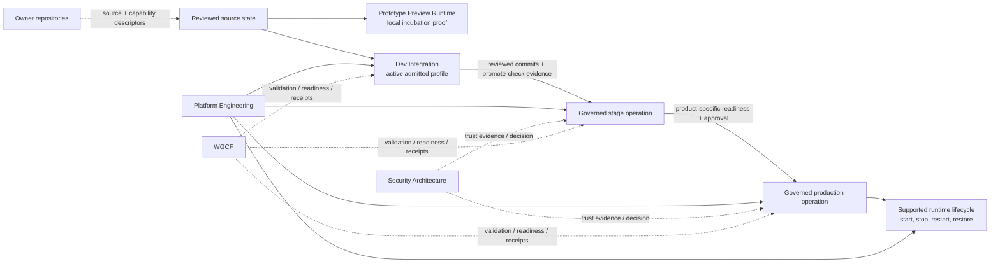
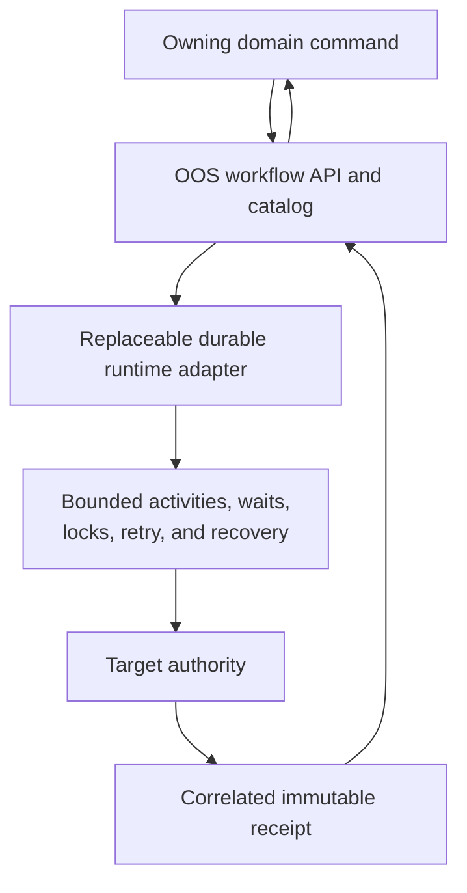
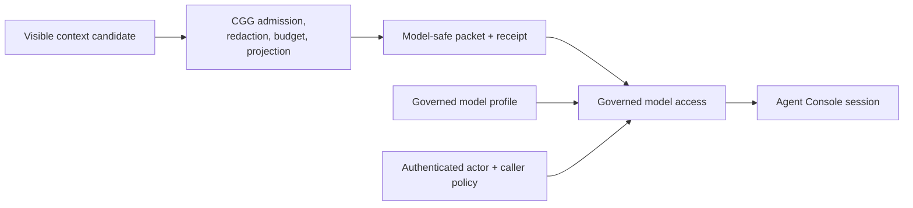

# Runtime And Release Architecture

Status: approved pre-baseline target projection.

Source: [`system-model.yaml`](../system-model.yaml). This view separates
incubation proof, local integration, governed environments, model access, and
durable workflow execution.

## Environment Path

## Environment Responsibilities

| Layer | Purpose | Authority | Does not imply |
| --- | --- | --- | --- |
| Prototype Preview Runtime | Operate a local preview and collect incubation evidence. | Workspace Prototype Studio for prototype record; local process for proof. | Dev-integration admission, platform readiness, stage, production, or Portfolio listing. |
| Dev Integration | Run fast local integration through an admitted active profile and produce stage-handoff evidence. | Workspace Governance profile contract plus Platform-owned runner. | Stage promotion or production approval. |
| Stage | Rehearse a product-supported governed release path. | Platform Engineering, with WGCF and Security evidence as required. | Production readiness or production activation. |
| Production | Execute a product-supported governed production operation. | Platform Engineering and the product release authority. | Universal support for every product or command. |
| Runtime lifecycle | Run only lifecycle commands declared by the product capability descriptor. | Platform Engineering and product-owned adapters. | A generic Console authority over arbitrary runtimes. |

Products without a governed release rail remain visible at their highest proven
endpoint. The Console does not synthesize stage, production, or runtime
controls.

## Workflow Execution

- OOS owns shared workflow APIs, catalog, correlation, and run control.
- A durable engine such as Temporal is an admitted implementation adapter
  behind OOS. It is not Console vocabulary or domain authority.
- Domain-specific workflow meaning remains in the owning domain.
- Definition source remains reviewed, versioned source in an owner repository.
- The Orchestration surface qualifies candidates, inspects definitions and
  runs, and requests bounded controls. It is not an in-browser workflow engine.

## Model And Context Path

| Capability | Responsibility |
| --- | --- |
| Model Operations | Project governed model profiles, caller eligibility, access readiness, runtime controls, and Security evidence. |
| Context Governance Gateway | Admit and transform operational context into bounded safe packets. |
| Federated Identity and Access | Authenticate the actor and enforce caller roles and authority. |
| Agent Console | Host separate bounded sessions and consume admitted context; it does not approve profiles or mutate domains. |

The current local agent connection is valid pre-baseline proof. Synthetic
context projection must be replaced with CGG-admitted packets before governed
live context use.

## Observation Boundary

Runtime Readiness is read-only observation of local host telemetry, declared
component coverage, freshness, and source-qualified alerts. It is separate from:

- WGCF readiness evaluation;
- Dev Integration profile state;
- product release readiness;
- stage or production operation state;
- Agent runtime presence.
