# Foundation Proof

Status: executable approved-baseline architecture proof.

Source: [`system-model.yaml`](../system-model.yaml). This view projects the
architecture exercised by the local
[foundation simulation](../../foundation-simulation-report.md). It is test
evidence for the approved local Console baseline, not live backend or
production evidence.

## Executed Path

```mermaid
flowchart LR
  Capture["Proposal capture"] --> Triage["Triage"]
  Triage --> Disposition{"Disposition"}
  Disposition -->|park or reject| Terminal["Terminal Proposal result"]
  Disposition -->|accept| RepoGate{"Repository gate"}
  RepoGate -->|unresolved| Blocked["Blocked with no handoff receipt"]
  RepoGate -->|resolved or not required| Route{"Prototype or Delivery"}

  Route -->|Prototype| Landing["Prototype Landing"]
  Landing --> Candidate["Candidate Promotion"]
  Candidate --> Preview["Preview proof"]
  Preview --> Baseline["Baseline Promotion"]
  Baseline --> Movement["Movement request"]
  Movement --> Delivery["Delivery Intake"]

  Route -->|Delivery| Delivery
  Delivery --> Design["Work Design"]
  Design --> Refinement["Refinement"]
  Refinement --> Execution["Execution handoff"]
  Execution --> Closeout["Delivery closeout"]
  Closeout --> History["Delivery history"]
  Closeout --> Outcome["Optional entrant candidate"]
  Outcome -. "contract-simulated:<br/>classification" .-> Intake["Workspace Intake"]
  Intake -. "contract-simulated:<br/>atomic promotion" .-> Inventory["Active product inventory"]
  Inventory --> Publication["Portfolio publication"]
  Publication --> Product["Managed product entry"]
```

Solid edges execute current Console-local models and projections. Dotted edges
run isolated contract simulators because their durable authorities and live
adapters belong outside the pre-baseline Console.

## Route Coverage

| Area | Distinct behaviors | Proof |
| --- | ---: | --- |
| Proposal | 8 | Capture, terminal decisions, resume, two destinations, invalid destination. |
| Repository gate | 3 | Existing, resolved new repository, unresolved gate rejection. |
| Prototype | 15 | Order guards, Landing recovery, all promotion decisions, preview, movement correction, closeout, retirement. |
| Delivery | 7 | Intake recovery, source-version rejection, Refinement retry, then product or ordinary closeout. |
| Workspace Governance | 12 | All classification outcomes, three inventory types, replay, stale and overlap guards. |
| Portfolio | 9 | Capture, review block, reject, create, duplicate, update, release, retirement, replay. |
| **Total** | **54** | **42 Console-local; 12 contract-simulated.** |

The catalog is
[`foundation-route-catalog.json`](https://github.com/mfshaf7/governance-operations-console/blob/9d8d2f0e550cd14ee915ecdb0aadd5cceddcc38d/tests/system-simulation/foundation-route-catalog.json).
The test fails when a catalogued behavior lacks a proof or when route ids are
duplicated.

## Boundary Agreement

- Every command carries source identity or version, actor, correlation, and
  idempotency truth appropriate to its local model.
- Repository resolution is a handoff gate; an unresolved gate cannot produce a
  successful Proposal handoff.
- Prototype order is Landing, Candidate, Preview when required, Baseline, then
  Movement. Terminal and correction routes remain explicit.
- An accepted Refinement receipt projects a distinct Execution package.
  Delivery closeout requires that handoff plus an OOS-shaped readiness
  snapshot and complete evidence. Every accepted closeout records Delivery
  history; optional impact is `none`, `workspace-entrant`, or
  `existing-product-change`.
- Workspace classification and active-inventory promotion are separate,
  versioned, receipt-producing operations. Their Console contracts mirror the
  canonical Workspace Intake, repository, product, and component schemas.
  Promotion is atomic in the simulator and follows repository, product, then
  component dependency order.
- Portfolio accepts only an active product version and keeps publication,
  listing, runtime, and product lifecycle as separate state.

## Test Product

The simulation serves a small static Focus Timer over an ephemeral local HTTP
server, fetches its HTML, CSS, and JavaScript, and verifies that its start,
pause, and reset controls exist. The fixture is test-only and does not become a
new Workspace product or mutate another repository.
