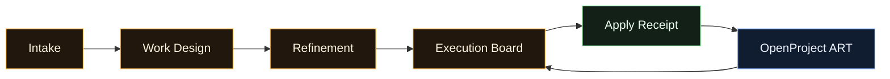
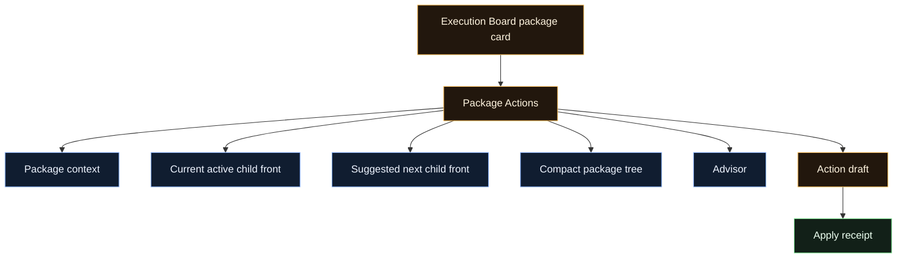
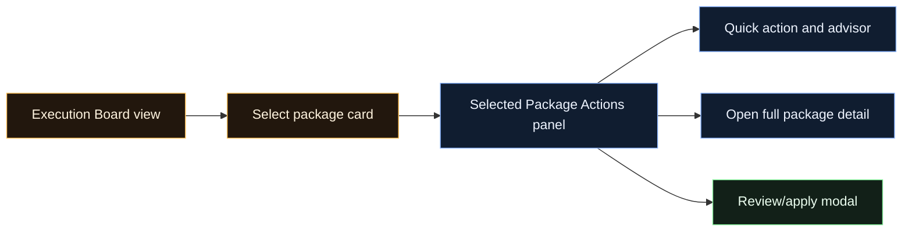
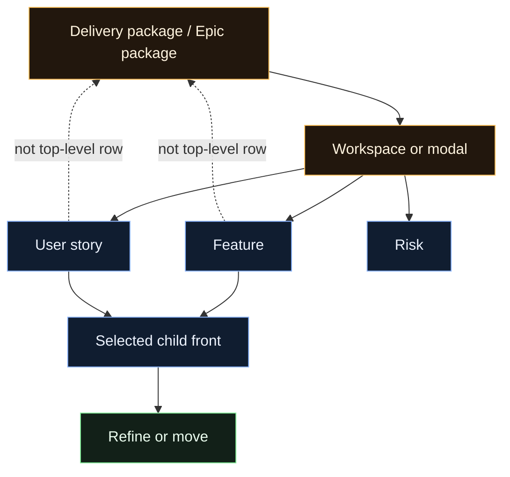
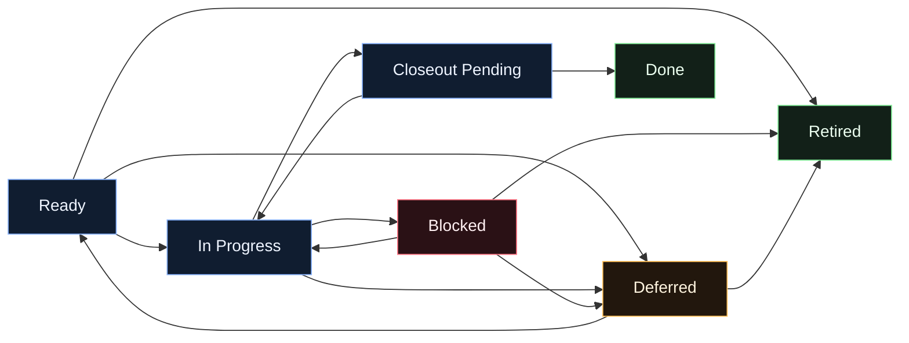
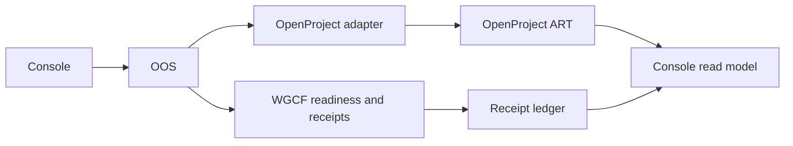
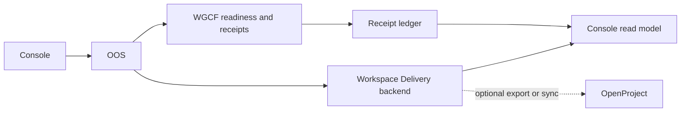

# Delivery System Design

Status: discussion draft, not baseline-approved.

This document records the current Delivery Console architecture discussion so
future UI work does not drift while the system is still OpenProject-backed. It
is not a locked decision record yet. Promote the agreed parts into the design
profile and decision log only after the operator approves the model.

## Current Phase And Target State

Current phase:

- Stabilize the console workflow while OpenProject remains the Workspace
  Delivery ART source of truth.
- Use the console as the operator-facing workflow surface for intake, work
  design, refinement, execution board control, apply review, and receipts.
- Route mutable operations through OOS-owned drafts and submission. WGCF may
  provide readiness, recommendation, and receipt references where supported, and
  OpenProject remains the current adapter-backed write target.

Target state:

- Evolve toward a Workspace Delivery backend that owns the same delivery
  package, board, map, tree, package-action, and receipt model directly.
- Treat OpenProject as the current backing store and adapter target, not the
  permanent domain model owner.
- Avoid copying OpenProject literally. Preserve the delivery concepts we need,
  then map OpenProject into those concepts during the transition.

## Implementation Guardrails

Status: required first-read guardrail for Delivery UI and mock-data work while
this discussion draft is active.

Read this section before changing Delivery UI, mock data, component props, or
workflow labels. The design is still pre-baseline, but implementation must not
drift from the approved discussion outcomes.

General rules:

- Use one OOS-shaped mock read-model fixture instead of scattering delivery
  state across components.
- Use one package-posture projection helper/model. Components must not compute
  package posture inline.
- Use one action matrix/helper. Components must not invent their own action
  buttons or route assumptions.
- UI components consume projected data only: `board_summary`, `art_map`,
  `art_tree`, `selected_package`, and `apply_intent`.
- Console code must not treat OOS, WGCF, or OpenProject as the permanent
  delivery-domain database. OOS orchestrates, WGCF governs, OpenProject is the
  current ART backing store, and a future Workspace Delivery backend may own
  durable delivery product state.
- Keep shared terminology labels in one place once implementation begins.
- Reuse existing locked desk/modal/button/status/table patterns before adding
  new visual patterns.

Package posture implementation rules:

- Do not create a new backend status enum for package posture.
- `Deferred` always maps to backend `parked`.
- `Closeout Pending` is derived only.
- `Active` is not a package posture. Use `In Progress`.

Action implementation rules:

- Every mutable action creates an OOS-shaped action intent or mutation draft
  before final apply.
- Every action must carry target, route, gate state, and expected receipt
  outcome.
- Quick actions open or prepare an action draft/apply review. They must not
  mutate ART directly.
- Milestone creation belongs to Refinement only. Execution Board may display
  milestone checkpoints as read-only package context, but must not expose them
  as executable fronts or package-action targets.
- WGCF fail-closed gating must only be claimed on routes that currently support
  it, such as `complete` and `stale-open-close`; other actions use
  route-specific OOS validation until future orchestration expands the gate.
- Unsupported future-only actions stay hidden unless they are explicitly shown
  as unavailable future work.

Read-model implementation rules:

- Mock data must match the future OOS projection shape.
- Stale, error, empty, unavailable, permission-denied, and projection-sync
  states belong in the read model, not as one-off panel state.
- Large ART trees must support collapsed counts and future lazy loading instead
  of assuming every node is always rendered.

Terminology guardrails:

- Do not introduce delivery-specific `Front Control`, generic package
  `movement`, `activate`, `Package #698`, or standalone delivery
  `Attach Evidence` wording in new implementation.
- Keep `Epic #...` visible as the OpenProject/ART identity.
- Use `Delivery Package` for the console wrapper and `Package Action` for
  actions that may target the Epic or a child front.

Validation guardrail:

- Before design baseline approval, add a lightweight terminology/projection
  check or equivalent focused review so banned legacy wording and scattered
  delivery mock state do not re-enter the implemented surface.

## Working Lifecycle



### Intake

Purpose: convert an accepted proposal into a Delivery package.

Current OpenProject-backed output:

- top-level Epic shell created or linked
- delivery package/session reference available

Does not own Feature/User story planning.

### Work Design

Purpose: let the operator and AI shape the work before execution readiness.

Owns:

- package design discussion with AI
- Epic, Feature, User story, and optional Risk structure
- scaffold/template completion for the work tree
- draft/session review before ART mutation

Does not own execution metadata repair or active execution actions.

### Refinement

Purpose: make the designed package backend-safe and execution-ready.

Owns:

- metadata repair/completion
- Epic-level contract fields
- Feature/User story metadata fields
- ownership, classification, PI/objective/placement fields where required
- readiness review and metadata apply receipt

Does not decide which work moves next.

### Execution Board

Purpose: human visual surface for controlling ready or active delivery work.

Owns:

- package posture view
- current/active front visibility
- next-front recommendation
- start-work, blocker, defer, retire, and closeout actions
- package-action surface
- package-action apply receipt

Does not list every Feature/User story as a top-level register row.

## Surface Ownership And Naming Cleanup

Status: approved discussion outcome for Point 6.

The Delivery system should use a small set of named operator surfaces. Each
surface owns one kind of work, and receipts or health signals should not become
extra workflow tabs unless they represent a real operator job.

Primary Delivery workflow surfaces:

| Surface | Owns | Must not own |
| --- | --- | --- |
| `Intake` | Accepted proposal consumption into an ART-backed Delivery Package shell. | Feature/User story planning, execution metadata repair, blockers, closeout, or active execution control. |
| `Work Design` | AI/operator shaping of a new Delivery Package tree before execution readiness. | Active execution decisions, blocker workflow, closeout, or metadata readiness as a separate repair job. |
| `Refinement` | Whole-package metadata and contract completion so OOS/OpenProject can accept clean ART state. | Deciding the next active front or controlling package execution. |
| `Execution Board` | Visual control of ready, in-progress, blocked, deferred, closeout-pending, done, and retired packages. | Metadata repair as the primary workflow or top-level rows for every Feature/User story. |

Supporting Delivery surface:

| Surface | Owns | Must not own |
| --- | --- | --- |
| `Audit Trail` | Package-scoped read-only trace of apply receipts, WGCF readiness references, action approvals, blocker/defer/retire/closeout decisions, evidence links, source revisions, read-model refresh notes, and failed or blocked apply attempts. | New action drafting, metadata repair, blocker resolution, closeout execution, active-front selection, projection repair execution, or workflow queue ownership. |

Existing non-Delivery health owners:

- `Workspace Pulse` may show high-level posture and source freshness signals.
- `Resources`, `Components`, and `Alerts` own platform observability, runtime
  health, diagnostics, and operational health detail.
- `AI / Model Operation` owns model/provider readiness and AI runtime posture.

Rules:

- Do not add a new Delivery-owned `System Health` surface for projection or
  stale-state concerns.
- Projection refresh and stale recovery are future orchestration
  responsibilities. Delivery surfaces can show stale or unsafe read-model truth
  when reported, but they do not offer manual projection-sync actions in this
  phase.
- `Audit Trail` may record that projection refresh was required or completed,
  but it is not the place where operators repair projection state.
- Receipts are attached to the workflow or package that produced them. The
  `Audit Trail` is the read-only place to inspect them later, not a new work
  queue.
- Phase 1 Audit Trail is package-scoped by default and opens from the selected
  package panel or package details.
- Future target state may add a global filterable Audit Trail for cross-package
  search by package, action type, receipt status, operator, date, source
  system, WGCF receipt, projection state, failed apply, or blocked gate. That
  future global surface must remain read-only and must not become a workflow
  queue.
- Mock/read-model data should use an `audit_events` shape that can support both
  package-scoped inspection now and global filtering later.

## Execution Board Views

The Execution Board should be a full-size workspace with three view tabs.

```text
Control Board | ART Map | ART Tree
```

Status: approved discussion outcome for Point 9.

Execution Board is a two-zone visual workspace:

```text
Header
  title, source/freshness, view tabs, board-level search and filters

Main
  left: Control Board, ART Map, or ART Tree
  right: Selected Package Panel

Footer
  none by default
```

Action buttons live in the Selected Package Panel or deeper action/apply/detail
modals. The Execution Board itself should not grow a heavy footer action bar.

### Control Board

Default human operational view.

Shows Epic/package cards grouped by execution posture, for example:

```text
Ready | In Progress | Blocked | Deferred | Closeout | Recently Done
```

The operator uses this view to answer:

```text
What needs attention now?
```

Clicking a package card selects the package and opens the same selected package
panel.

Control Board rules:

- Group package cards by package posture: `Ready`, `In Progress`, `Blocked`,
  `Deferred`, `Closeout Pending`, and lower-priority `Done`/`Retired`.
- `Done` and `Retired` stay visible but low-priority or collapsible by default
  so the board does not become a history dump.
- Cards show package identity, posture pill, current/suggested front,
  blocker/closeout signal, and source/freshness when relevant.
- Quick action is allowed only when the target is unambiguous and target
  context is visible. Otherwise the Selected Package Panel owns the action.

### ART Map

Wider family/lane view inspired by the current OpenProject architecture/family
board.

Shows:

- families or lanes
- package cards inside each family
- selected package highlight
- state pills
- no child flooding by default

The operator uses this view to answer:

```text
Where does this package sit in the wider ART picture?
```

Clicking an Epic/package card selects the package and opens the same selected
package panel.

ART Map rules:

- Shows families or lanes horizontally when space allows.
- Shows package cards inside each family/lane.
- Selected family and selected package receive stronger highlight.
- Does not expand every child by default. It is context view, not the detailed
  tree.
- Used to answer where the package sits in the wider ART picture.

### ART Tree

Full hierarchy view.

Shows:

```text
Family
  Epic package
    Feature
      User story
        Task
    Defect
    Risk
```

The tree must be collapsible by default and designed for large scale. Feature
and User story actions still route through package context instead of becoming
top-level board actions.

The operator uses this view to answer:

```text
What is the full structure and child shape?
```

ART Tree rules:

- ART Tree is collapsed by default.
- Every expandable node can collapse or expand independently.
- Support global controls: `Collapse All`, `Expand Selected`, and
  `Expand To Depth`.
- Expand/collapse applies to Epic, Feature, User story, Risk, and Milestone
  only when they have child or linked work.
- Collapsed nodes show child counts, such as `6 stories hidden`,
  `3 tasks hidden`, or `2 risks linked`.
- Expanded state is remembered per package while the board is open.
- Large trees must use collapsed counts and leave room for future lazy loading
  or virtualization.
- ART Tree can select a child node, but the right panel must still separate
  Delivery Package context from Action Target.
- Package/Epic nodes must be visually distinct from child Feature/User story
  cards so package control is not confused with child execution.

### Shared Board Rules

- Selection persists across `Control Board`, `ART Map`, and `ART Tree`.
- Closing action, apply, detail, or Audit Trail surfaces returns to the same
  view with the same package selected.
- Board-level search and filters apply across all three views: posture, family,
  owner/team, text/ref, blocked signal, deferred signal, and closeout signal.
- Each view needs explicit empty/error states: no packages, no package
  selected, stale projection, backend unavailable, permission denied, and
  package missing after refresh.
- Desktop layout uses left active view plus right Selected Package Panel.
- Narrow viewports convert the Selected Package Panel into a drawer or focused
  panel instead of squeezing the board into unreadable columns.
- Audit Trail appears as package-scoped read-only access from the selected
  package panel or package details. It is not part of the main board layout.
- No standalone action button should appear without target context.
- The three board views consume the same read model and selection state; they
  must not maintain separate local package or target state.

## View And Read-Model Contract

Status: approved discussion direction, details under discussion.

The Execution Board should be designed around explicit read models so the UI
does not reconstruct delivery truth from scattered fields. Mock data should use
the same shape expected from the future OOS read model.

### Board Summary Model

Used by the default `Control Board`.

Purpose:

```text
What needs attention now?
```

Minimum fields:

- delivery package title
- `Epic #...` identity
- `OpenProject Epic` source reference during the current phase
- package posture
- family or lane
- current active front, if any
- suggested next front, if any
- blocker count and blocker summary signal
- closeout signal
- open child count
- quick action label
- available quick-action target, if already known

### ART Map Model

Used by the `ART Map` tab.

Purpose:

```text
Where does this package sit in the wider ART picture?
```

Minimum fields:

- family/lane list
- package cards per family/lane
- selected package marker
- package posture pill
- high-level package counts per family/lane
- blocker, deferred, closeout, and done counts per family/lane
- family/lane summary signal

The ART Map does not show the full child tree by default.

### ART Tree Model

Used by the `ART Tree` tab and deeper inspection.

Purpose:

```text
What is the full structure and child shape?
```

Minimum fields:

- Epic root with `Epic #...` identity
- Feature children
- User story children
- Task children where relevant
- Defect and Risk nodes where relevant
- node status
- node type
- node owner or team when available
- node blocker/deferred/closeout signal
- child counts
- collapsed/expanded default hints
- node action availability inside selected package context

The tree may show all hierarchy, but child actions still route through selected
package context rather than becoming top-level board rows.

### Selected Package Model

Used by the selected package panel or Package Actions surface.

Purpose:

```text
What can I safely do with this Delivery Package now?
```

Minimum fields:

- `Delivery Package` heading
- `Epic #...` identity and source reference
- package posture
- current active front
- suggested next front
- blocker summary
- closeout readiness
- available actions
- target required/not-required state for each action
- advisor recommendation and reason
- metadata or readiness warnings
- buttons/links to ART Map, ART Tree, action draft, and apply review

### Apply Model

Used by guarded action modals and apply review.

Purpose:

```text
What exactly will be changed, through which route, and what receipt should the
operator expect?
```

Minimum fields:

- selected action
- exact target type and id
- target display name
- backend route
- required payload fields
- gate checks
- expected backend state after apply
- expected package posture after read-model refresh
- advisor reason, if used
- operator approval state
- UI receipt outcome category: `accepted`, `blocked_by_gate`, `rejected`,
  `apply_failed`, or `projection_sync_required`
- backend receipt and projection references when available

Working OOS-shaped projection:

```text
board_summary
art_map
art_tree
selected_package
apply_intent
```

### Read-Model Completion Rules

Status: approved discussion outcome.

- Every read-model object needs stable IDs where applicable:
  `delivery_package_id`, `epic_id`, `record_ref`, child `work_item_id`, and
  `source_system`.
- Every model should expose freshness/sync state: last read time, source
  revision when available, projection sync state, stale state, and read-error
  state.
- Available actions must include availability metadata: `allowed`,
  `disabled_reason`, `required_gate`, and `backend_route`.
- Counts must distinguish open and terminal work. Prefer explicit counts such
  as `open_child_count`, `terminal_child_count`, `blocked_child_count`, and
  `deferred_child_count`.
- Large tree support must be designed into the model: collapsed node counts,
  visible depth, future lazy child loading, and future search/filter hooks.
- Advisor input must be a bounded packet, not arbitrary UI state. It should
  include selected package, current/suggested front, blockers,
  closeout/readiness signals, ART map context summary, and allowed actions.
- Error and empty states must be explicit: no package selected, package missing,
  backend unavailable, projection drift, and permission denied.
- Apply intent must link forward to durable proof fields: `intent_id`,
  `draft_id`, `receipt_id`, `wgcf_receipt_ref`, and `projection_sync_ref` where
  available.
- Selection should persist across refresh by `delivery_package_id` when the same
  package still exists. If the package disappears, show the explicit package
  missing state.
- Board and map ordering must be deterministic. Default priority:
  `Blocked`, `Closeout Pending`, `In Progress`, `Ready`, `Deferred`, then
  `Done`/`Retired` as lower-priority or hidden-by-default history.
- Board and map models should include future filter/search hooks for family,
  posture, owner/team, and text search.
- Package and node models should include dependency signals when available:
  dependency count, unresolved dependency count, and cross-package dependency
  count.
- Every view should expose source-truth labels such as `mock`, `OOS`,
  `OpenProject-backed OOS`, or future `Workspace Delivery backend`.

## Mock Data And Read-Model Migration

Status: approved discussion outcome for Point 7.

The existing Delivery mock data should not be adapter-mapped into the new
architecture. It still encodes old surface ownership such as `Drafting`,
`Fronts`, `Metadata Readiness`, `Front Control`, delivery-specific `Movement`,
and component-local state. Mapping that forward would preserve the wrong model.

Decision:

```text
Delete or quarantine old Delivery mock shapes and rebuild one clean
OOS-shaped read model from OpenProject/ART truth concepts.
```

Implementation direction:

- Add one canonical Delivery read-model fixture, likely
  `src/data/delivery-read-model.ts`.
- Keep Delivery package truth out of `today.ts`. `today.ts` may consume compact
  summaries later, but it must not own Delivery package, tree, action, or audit
  truth.
- Add a selector/helper module, likely `src/data/delivery-selectors.ts`.
- Keep the mock OpenProject-truth-compatible, but do not copy OpenProject UI
  shape literally.
- Drive new Delivery UI from selectors over the canonical read model.
- Components must not compute package posture, action availability, selected
  package state, tree state, or audit state independently.
- Define TypeScript types for the read model and selectors instead of relying
  on untyped object literals.
- Delete old Delivery mock branches only after replacements exist and no
  component imports them.
- Keep non-Delivery mocks untouched.
- Add a guard or focused review for banned legacy Delivery terms and scattered
  Delivery mock state before baseline.

Canonical mock projection:

```text
delivery_read_model
  schema_version
  generated_at
  source_truth
  projection_state
  selected_delivery_package_id
  board_summary
  art_map
  art_tree
  selected_package
  apply_intent
  audit_events
```

Required read-model shape:

```text
delivery_read_model
  schema_version: 1
  generated_at
  source_truth: mock | OOS | OpenProject-backed OOS | Workspace Delivery backend
  projection_state
    status: fresh | stale | projection_sync_required | read_error | permission_denied | backend_unavailable
    source_revision
    last_successful_refresh_at
    message
  selected_delivery_package_id
  board_summary
    package_counts
    posture_columns
    package_cards[]
  art_map
    families[]
    lanes[]
    selected_delivery_package_id
  art_tree
    root_package_ids[]
    nodes_by_id
    collapsed_counts
    selected_node_id
  selected_package
    delivery_package_id
    epic_id
    source_ref
    title
    workflow_stage
    package_posture
    current_front
    suggested_front
    available_actions[]
    latest_receipt
    audit_summary
    warnings[]
  apply_intent
    intent_id
    delivery_package_id
    target_type
    target_id
    action_type
    backend_route
    required_fields[]
    gate_checks[]
    operator_payload
    expected_result
    receipt_category
  audit_events[]
    event_id
    delivery_package_id
    source_epic_id
    action_type
    target_type
    target_id
    actor
    status
    receipt_refs[]
    created_at
```

Required IDs:

- `delivery_package_id` is the console package identity and must remain stable
  across board, map, tree, selected package, apply, and audit models.
- `epic_id` and `source_ref` preserve OpenProject/ART identity.
- child nodes use `work_item_id`, `source_ref`, `type`, `status`, and
  `parent_id`.
- every mutable action must preserve `source_revision` or equivalent stale
  detection data before apply.

State separation:

- `workflow_stage` describes where the package belongs in the Delivery system:
  `intake`, `work_design`, `refinement`, `execution`, or `audit_only`.
- `package_posture` describes execution board posture only:
  `Ready`, `In Progress`, `Blocked`, `Deferred`, `Closeout Pending`, `Done`,
  or `Retired`.
- backend `status` keeps OpenProject-compatible values:
  `new`, `ready`, `in-progress`, `blocked`, `parked`, `retired`, or `done`.

Required selector layer:

- `getPackagePosture`
- `getAvailableActions`
- `getSelectedPackage`
- `getPackageTree`
- `getPackageAuditEvents`
- `getApplyIntent`

Required implementation files:

- `src/data/delivery-read-model.ts`
  - owns the canonical mock fixture and read-model TypeScript types
- `src/data/delivery-selectors.ts`
  - owns posture, action, selected-package, tree, apply, and audit selectors
- Delivery UI components
  - consume selectors and projected view models only

OpenProject/ART truth concepts preserved in the mock:

- Epic identity and source reference
- Feature, User story, Task, Defect, Risk, and Milestone hierarchy
- backend status: `new`, `ready`, `in-progress`, `blocked`, `parked`,
  `retired`, and `done`
- `Target PI`, `Iteration`, `Delivery Team`, `Assignee`, and `Responsible`
  where relevant
- initiative lineage fields: `Initiative Family`, `Lineage Role`,
  `Architecture Anchor Ref`, and `Required Upstream Ref`
- blocker fields
- parking and retirement fields
- completion and evidence fields
- OOS route availability
- projection and freshness state

Required scenario coverage:

| Case | Purpose |
| --- | --- |
| `new/intake shell` | Accepted proposal consumed or ready to consume. |
| `work design active` | Package tree is being shaped and is not execution-ready. |
| `refinement needed` | Metadata gaps block execution readiness. |
| `ready` | Clean package ready to start work. |
| `in progress` | Active child front selected. |
| `blocked` | Blocker workflow required. |
| `deferred / parked` | Reversible inactive work. |
| `retired` | Terminal inactive package. |
| `closeout pending` | Done-ish work needs evidence or closeout. |
| `done` | Read-only receipt and evidence inspection. |
| `projection stale` | Read model is not trustworthy yet, with no manual sync action. |
| `apply failed / rejected` | Action draft did not apply cleanly. |
| `large tree` | Many Features/User stories with collapsed counts tested. |
| `mixed child states` | Feature with ready, in-progress, blocked, and done children. |
| `package action vs child action` | Proves target separation in the UI. |
| `audit-rich package` | Multiple receipts, decisions, and events. |
| `empty / permission / backend unavailable` | Explicit non-happy states. |

Scenario identity rule:

- Each required scenario must have a clear package or fixture identity. Do not
  overload one mock package to stand for every state.
- `Epic #698` may be the main architecture-control example, but blocked,
  deferred, retired, done, stale, failed-apply, audit-rich, and large-tree cases
  need their own clear package identities or explicit fixture variants.
- Every scenario should state which view it primarily tests:
  `Control Board`, `ART Map`, `ART Tree`, `Selected Package Panel`,
  `Action Draft`, `Apply Review`, or `Audit Trail`.

Migration rule:

```text
The new Delivery mock must cover happy path, blocked path, deferred/retired
path, closeout path, stale/projection path, failed-apply path, large-tree path,
and empty/error states before the old Delivery mock is deleted.
```

Validation guard:

- New Delivery UI should fail focused review or lightweight validation when it:
  - imports old Delivery mock branches directly
  - introduces banned legacy names such as delivery-specific `Front Control`,
    workflow-level `Drafting`, `Metadata Readiness`, `Fronts`, or package-level
    delivery `Movement`
  - omits required scenario coverage
  - computes package posture or available actions inside components
  - reads raw tree structures directly instead of selectors

## Package Actions

Package Actions is the selected-package action system opened from any Execution
Board view. The immediate surface is the Selected Package Panel. Deeper surfaces
open only for front selection, action draft, apply review, or full package
details.



Status: approved discussion outcome, backend-contract checked, not
baseline-approved.

Actions are posture-gated. The board, selected-package panel, and action modals
must not show every possible action everywhere.

### Action Layers

Use two operator layers:

1. Board card quick action
   - shows one or two obvious actions only, such as `Start Work`,
     `Review Blocker`, `Open Closeout`, or `Resume`
2. Selected package panel
   - shows richer actions, advisor, current/next front, context, and guarded
     apply entry

Deep forms open only after the operator chooses a concrete action.

### Actions By Package Posture

| Package posture | Primary operator action | Secondary actions | Backend direction |
| --- | --- | --- | --- |
| `Ready` | `Start Work` | `View ART Tree`, `Ask Advisor`, `Defer`, `Retire` | Start updates the selected executable child front to `in-progress`; defer/retire uses parking or initiative governance depending on scope. |
| `In Progress` | `View Active Front` or `Open Closeout` | `Block`, `Defer`, `Ask Advisor`, `View ART Tree` | Closeout uses work-item completion or stale-open closeout; blocker uses blocker workflow; defer uses parking. |
| `Blocked` | `Review Blocker` | `Clear Blocker`, `Defer`, `Retire`, `Ask Advisor` | Set/clear blocker uses the bounded blocker workflow. Clearing may resume only to `new`, `ready`, or `in-progress`. |
| `Deferred` | `Resume` | `Revise Deferral`, `Retire`, `View Context`, `Ask Advisor` | Resume and deferral revision use parking workflow; UI label `Deferred` maps to backend `parked`. |
| `Closeout Pending` | `Open Closeout` | `Continue Remaining Work`, `Ask Advisor` | Completion evidence is captured inside `complete`, `stale-open-close`, or initiative closeout flows. Continuing remaining work is a derived posture result, not a direct write. |
| `Done` | `View Receipt` | `View Evidence`, `Open ART Tree` | Read-only by default. No normal execution action. |
| `Retired` | `View Retirement Reason` | `View Receipt`, `Open ART Tree` | Read-only by default. No normal execution action. |

### Backend-Supported Action Routes

Current supported routes:

- `GET /v1/delivery-initiatives/{delivery_id}/active-session-packet`
- `GET /v1/delivery-initiatives/{delivery_id}/execution-summary`
- `GET /v1/delivery-initiatives/{delivery_id}/planning`
- `GET /v1/delivery-initiatives/{delivery_id}/review-pack`
- `GET /v1/delivery-initiatives/{delivery_id}/evidence-packet`
- `GET /v1/delivery-initiatives/{delivery_id}/closeout-readiness`
- `GET /v1/delivery-work-items/{work_item_id}/continuation-context`
- `GET /v1/delivery-work-items/{work_item_id}/evidence-packet`
- `POST /v1/delivery-work-items/{work_item_id}/update`
- `POST /v1/delivery-work-items/{work_item_id}/blocker`
- `POST /v1/delivery-work-items/{work_item_id}/parking`
- `POST /v1/delivery-work-items/{work_item_id}/complete`
- `POST /v1/delivery-work-items/{work_item_id}/stale-open-close`
- `POST /v1/delivery-initiatives/{delivery_id}/governance`
- `POST /v1/delivery-initiatives/{delivery_id}/close`

Action wording rules:

- Use `Start Work`, not `Activate Epic`. The executable target is the selected
  child front, not the package Epic when it has executable children.
- Use `Revise Deferral`, not `Update Review Date`, because deferral review date
  is handled through the parking workflow rather than a dedicated endpoint.
- Use `Continue Remaining Work`, not `Return To In Progress`, because
  `In Progress` is the derived package posture after closeout when open work
  remains.
- Do not expose `Attach Evidence` as a standalone action until a dedicated
  evidence route exists. Evidence belongs inside completion, stale-open
  closeout, or initiative closeout flows.
- `Ask Advisor` is recommendation-only and must not imply mutation authority.

Unsupported future-only capabilities:

- `Reopen`
- `Restore Retired`
- direct package/Epic start-work as executable work
- direct OpenProject mutation from the console

### Action Completion Rules

Status: approved discussion outcome.

- Every action must show its exact target before apply: `Package`, `Feature`,
  `User story`, `Task`, `Defect`, or `Risk`.
- `Start Work` must never silently target the package Epic. It targets a
  selected executable child front.
- If no executable child front is selected, `Start Work` opens front selection
  before it opens apply review.
- Dangerous actions must show scope impact. `Defer` and `Retire` must make clear
  whether the operator is acting on one child front or the whole package.
- Whole-package retirement must show child impact and must respect initiative
  retirement gates.
- Action availability comes from package posture plus backend gates, not from
  posture alone. The read model should consider closeout readiness, blocker
  state, active front, child count, terminal descendants, and route support.
- Quick actions prepare or open an action draft. They must not mutate ART
  directly.
- Final mutation requires guarded apply review and an apply receipt.
- `Start Work` is a UI action, not a backend endpoint name. It prepares an
  update against the selected executable child front.
- `Open Closeout` is a UI action, not a mutation. The final mutation routes
  through `complete`, `stale-open-close`, or initiative closeout as applicable.
- `Continue Remaining Work` is normally a derived read-model result or return
  path, not a direct backend mutation.
- Advisor recommendations may propose action, target, and reason, but never
  execute or bypass operator approval.
- Every mutation result must surface one UI receipt category: `accepted`,
  `blocked_by_gate`, `rejected`, `apply_failed`, or
  `projection_sync_required`. These are UI categories over backend responses,
  not assumed backend enum names.

Blocker and closeout are actions inside Package Actions through the selected
package panel, not standalone primary Delivery desk systems.

## Package Versus Child-Front Action Separation

Status: approved discussion outcome for Point 8.

Selecting a Delivery Package must not make every action implicitly target the
package Epic. The operator must always be able to see whether the next action
targets the package, a selected child front, the package plus child impact, or a
read-only inspection path.

Action scopes:

| Scope | Meaning |
| --- | --- |
| `package` | Acts on the Delivery Package / Epic shell. |
| `child_front` | Acts on a selected child Feature, User story, Task, Defect, or Risk. |
| `package_with_children` | Acts on the package and must show child impact. |
| `read_only` | Inspection only; no mutation. |

Selected Package Panel must separate package context from action target:

```text
Delivery Package
Epic #698 - Governed AI Control Plane

Action Target
User story #714 - Broker draft validation
```

If no executable child front is selected:

```text
Action Target
No executable front selected
[Select Front]
```

Action target rules:

| Action | Default target rule |
| --- | --- |
| `Start Work` | Child front only. Prefer User story, Task, or Defect. A Feature is not executable unless OOS continuation context explicitly says it is actionable. |
| `Block` | Selected child front by default. Whole-package block is allowed only when operator chooses package scope and sees child impact. |
| `Clear Blocker` | The blocker-owned target. |
| `Defer` | Selected child front or whole package. Scope must be explicit. |
| `Retire` | Selected child front or whole package. Scope and child impact must be explicit. |
| `Open Closeout` | Closeout-ready child or package from closeout readiness, not arbitrary tree selection. |
| `Continue Remaining Work` | No direct mutation. Selects or returns to the next remaining front. |
| `View Tree`, `View Receipt`, `Open Details`, `Open Audit Trail` | Read-only. |

Target source must be visible. The selected target should say whether it came
from:

- operator selection
- current active front
- advisor suggestion
- closeout readiness
- blocker record

Dangerous scope rules:

- `Defer`, `Retire`, and whole-package `Block` must show package target, child
  impact count, affected open fronts, and whether the action is reversible.
- No ambiguous action may silently pick a child target. If more than one valid
  child front exists, `Start Work` opens front selection first.
- Execution Board package actions are single-target in Phase 1. Bulk execution
  actions stay out of scope until explicitly designed.

Apply Review guard:

- Apply Review cannot open unless the action has a valid target and explicit
  scope.
- Package-level dangerous actions must show child impact.
- Child-front actions must preserve package context.
- Receipts and audit events must store package identity, target identity, scope,
  and whether the target came from operator selection, advisor suggestion,
  current active front, closeout readiness, or blocker record.
- `Done` and `Retired` packages stay read-only by default. They may expose
  receipt, evidence, tree/details, and package-scoped Audit Trail inspection.

## Interaction Model And Surface Shape

Status: approved discussion outcome for Point 4.

Clicking a package card should not open a full modal immediately. The Execution
Board keeps the board visible and opens a selected-package action panel in the
same full-size workspace.



The intent is:

- keep the board, ART Map, or ART Tree visible while a package is selected
- show current front, suggested front, blocker/closeout signal, and advisor in
  the selected-package panel
- use the panel for common actions such as start work, block, defer, retire,
  closeout, ask advisor, and open tree
- open a deeper Package Detail modal only when tree-heavy inspection or
  complex child-front selection is needed
- open a guarded Apply modal for final mutation and receipt capture

Approved workspace shape:

```text
Execution Board
[Control Board] [ART Map] [ART Tree]

┌──────────── board / map / tree view ────────────┬── Selected Package ──────┐
│ Ready | In Progress | Blocked | Deferred        │ #698 Governance runtime   │
│                                                  │ Current: none             │
│ #698 card selected                              │ Suggested: #714           │
│ #714 active card                                │ Advisor reason            │
│ #251 blocked card                               │ [Start Work] [Defer]      │
│                                                  │ [Open Tree] [Ask Advisor] │
└──────────────────────────────────────────────────┴──────────────────────────┘
```

This locks the interaction model from:

```text
package card -> Package Actions modal immediately
```

to:

```text
package card -> selected package panel -> detail/apply modal only when needed
```

Decision: `Package Actions` is the action system. `Selected Package Panel` is
the immediate panel. `Action Draft`, `Apply Review`, and `Package Details` are
the deeper modal surfaces.

### Execution Board Layout Contract

The Execution Board must be a real workspace, not a cramped tab card or a modal
pretending to be a board.

Layout rules:

- Use a full-size Execution Board surface.
- Top area owns title, source/freshness, and the three view tabs:
  `Control Board`, `ART Map`, and `ART Tree`.
- Main area uses two zones:
  - left/main: board, map, or tree view
  - right: selected package panel
- The selected package panel needs a real usable width, roughly `380-460px` on
  desktop-class layouts.
- The main view owns its own scroll. The selected package panel owns its own
  internal scroll only when content requires it.
- On narrow viewports, the selected package panel becomes a bottom drawer or a
  focused panel view. It must not squeeze the board/map/tree into unreadable
  columns.
- Deeper modals are reserved for front selection, action draft, apply review,
  and full package details.

Implementation shape:

```text
ExecutionBoardShell
  ControlBoardView
  ArtMapView
  ArtTreeView
  SelectedPackagePanel
  ActionDraftModal
  ApplyReviewModal
```

Minimal UI state:

```text
active_view
selected_delivery_package_id
active_action_intent
```

All components consume the shared read model. They must not maintain separate
posture/action state.

### Interaction Completion Rules

Status: approved discussion outcome.

- Selection persists across `Control Board`, `ART Map`, and `ART Tree`.
- If the selected package still exists after refresh, keep it selected by
  `delivery_package_id`.
- If no package is selected, the selected package panel shows a useful neutral
  state.
- If the selected package disappears after refresh, show the explicit package
  missing state.
- The operator can collapse or hide the selected package panel to give full
  width back to the current view.
- Card quick actions and panel actions must route to the same action intent.
  Do not create duplicate implementations.
- Selecting a package should keep focus behavior accessible: either keep focus
  on the selected card with selected state or move focus logically to the panel
  heading.
- Closing an action draft, apply review, detail modal, or front selector returns
  to the Execution Board with the same package selected.
- The selected package panel shows only posture-relevant actions.
- `Open Details` exists as the escape hatch for large tree, metadata, or
  evidence inspection.
- Advisor is compact inside the selected package panel. A full advisor console
  opens only when the operator asks for it.
- `Done` and `Retired` packages remain selectable, but the selected panel stays
  read-only by default: receipt, evidence, and tree/context.
- Scroll ownership must stay explicit so board/map/tree scrolling does not fight
  selected-panel scrolling.

## Apply And Receipt Boundary

Status: approved discussion outcome for Point 5.

Every mutable package action must pass through an explicit apply boundary. The
Execution Board may prepare action intent, but it must not treat a button click
as a completed ART mutation.

Approved working flow:

```text
Selected Package Panel
  -> UI action intent
  -> OOS-shaped mutation draft
  -> Apply Review
  -> OOS submit
  -> route-specific validation / WGCF where supported
  -> backend write through the OpenProject adapter
  -> apply receipt / projection checkpoint
  -> read-model refresh
  -> Execution Board update
```

Authority rules:

- OOS owns ART mutation draft creation, validation, and submission.
- WGCF may recommend, classify, and provide readiness or receipt references,
  but it must not mutate ART directly.
- WGCF fail-closed mutation gating is currently explicit for completion-style
  routes: `complete` and `stale-open-close`.
- The blocker route is a remediation path and is not wrapped by the same
  fail-closed WGCF gate.
- The console must not call OpenProject directly for delivery execution writes.
- The board state changes only after the read model reflects the apply result.

Minimum action intent fields:

- `intent_id`
- `delivery_package_id`
- `source_epic_id`
- `target_type`
- `target_id`
- `target_display_name`
- `action_type`
- `scope`
- `current_backend_status`
- `current_package_posture`
- `expected_backend_route`
- `required_payload_fields`
- `gate_checks`
- `operator_payload`
- `advisor_reason`
- `source_revision`
- `dirty_state`

Action route mapping:

| UI action | Mutation meaning | Backend direction |
| --- | --- | --- |
| `Start Work` | Move selected executable child front toward execution. | Prepare `work-item.update` against the selected child front; do not target the package Epic silently. |
| `Block` | Record a bounded blocker. | Use `work-item.blocker` with blocker statement, impact, owner, decision path, justification, and review/follow-up fields when required. |
| `Clear Blocker` | Clear blocker through the same bounded path. | Use `work-item.blocker`; resume may only return to an allowed nonterminal posture. |
| `Defer` | Remove work from active focus while keeping it open. | Use `work-item.parking` with `park_decision=defer`, `park_reason`, and `park_review_date`. |
| `Resume` | Bring deferred work back from parked posture. | Use `work-item.parking` resume semantics. |
| `Retire` | Move invalid, duplicate, superseded, absorbed, cancelled, or withdrawn work to terminal inactive posture. | Use `work-item.parking` with `park_decision=retire` and retirement reason; whole-package retirement must respect initiative gates. |
| `Open Closeout` | Start closeout review. | No immediate mutation. Final apply routes through `complete`, `stale-open-close`, or initiative closeout. |
| `Continue Remaining Work` | Return to remaining executable work after closeout review finds open scope. | Normally no direct mutation; refresh posture and select the remaining front. |

Apply Review must show:

- exact target type and target id
- target display name
- current state and expected result
- scope impact, especially for defer, retire, and closeout
- required justification or evidence fields
- gate checks and route-specific validation state
- advisor recommendation when used
- human-readable backend route meaning
- source revision or stale-source warning

Visible UI receipt categories:

| UI receipt category | Meaning |
| --- | --- |
| `accepted` | OOS/backend accepted the mutation and the read model can refresh. |
| `blocked_by_gate` | The action draft is meaningful, but route validation or WGCF readiness blocked mutation. |
| `rejected` | The payload/action is invalid for the route or target. |
| `apply_failed` | OOS, adapter, or backend failed before a trustworthy accepted result. |
| `projection_sync_required` | The write was accepted or may have been accepted, but derived board/roadmap projection is not yet safe to treat as final. |

Return behavior:

- `accepted`: show receipt, refresh the read model, keep the same package
  selected, and update package posture from projection.
- `blocked_by_gate`: preserve the draft and show the gate finding.
- `rejected`: preserve the draft and show validation errors.
- `apply_failed`: preserve the draft and do not claim board state changed.
- `projection_sync_required`: show a receipt-like sync warning and keep board
  state conservative. Do not present manual projection sync as a Delivery
  operator action in this phase.

Contract limits that must stay visible:

- `Start Work`, `Open Closeout`, and `Continue Remaining Work` are UI actions,
  not backend operation names.
- UI receipt categories are console categories over backend responses, not
  assumed backend enum names.
- Projection refresh and stale-state recovery are future orchestration
  responsibilities. Delivery surfaces may display stale or unsafe read-model
  truth when reported, but they must not introduce a manual projection-sync
  workflow before the 698 orchestration work defines that path.
- Future orchestration may broaden WGCF checks, but current UI must not claim a
  blanket WGCF gate for every action until that exists.

## Register Grain Rule

Top-level Delivery views should show work packages or sessions, not every ART
child.



Rule:

```text
Registers and boards show operator work packages. Feature/User story items are
selected inside the package workspace/tree and must not flood top-level views.
```

## Package Posture Projection

Status: approved discussion outcome, baseline-blocked by contract cleanup.

Package posture is a console/OOS read-model projection. It must not become a
new OpenProject status enum or a generic writable field.

Ownership decision:

- Prototype/mock phase: the console may compute package posture locally from
  mock data to keep UI exploration moving.
- Durable OpenProject-backed phase: OOS owns `package_posture` in the delivery
  read model so every operator surface receives the same posture projection.
- WGCF may validate, recommend, and issue receipts, but it does not own or
  mutate package posture.
- OpenProject remains the backing work-state store during the current phase,
  not the package-posture authority.

The current OpenProject-backed status vocabulary is:

```text
new | ready | in-progress | blocked | parked | retired | done
```

The console may use more operator-friendly posture labels, but mutations must
still route through the supported OOS/OpenProject workflow for the underlying
state.

`new` is not an Execution Board posture by itself. `new` work belongs in Work
Design or Refinement until the package has enough contract and readiness truth
to enter the Execution Board.

| Console posture | Backing truth | Meaning |
| --- | --- | --- |
| `Ready` | metadata/refinement receipt plus `ready` or equivalent next-front read | Package passed refinement/readiness, has no active blocker/defer/closeout condition, and has at least one selectable next front. |
| `In Progress` | at least one active `in-progress` child, completed child work with remaining open descendants, or selected active front state | Package execution has started and still has non-terminal required work. |
| `Blocked` | `blocked` status or active blocker fields on the package, active front, or next required child front | Exact next committed step cannot proceed and must be handled through the blocker workflow. |
| `Deferred` | backend `parked` status and parking fields | Package or child work is intentionally removed from active focus for possible later return. |
| `Closeout Pending` | closeout-readiness, stale-open candidate, child completion evidence gap, weak evidence, or closeout-ready-but-not-final state | A front or package needs closeout evidence/approval before it can move forward or close. This is derived, not directly writable. |
| `Done` | backend `done` plus completion/initiative closeout gates | All required descendants are terminal, no blocker remains, evidence is clean, and final closeout gates pass. |
| `Retired` | backend `retired` plus retirement gates | Work is terminal inactive and not expected to return. |

Important rule:

```text
If a child front closes and required open child work remains, the package returns
to In Progress, not Done.
```

Projection precedence:

```text
Retired > Done > Blocked > Deferred > Closeout Pending > In Progress > Ready
```

Use that precedence when signals overlap. For example, a package with a blocked
active child is `Blocked` even if other children are ready, and a parked package
is `Deferred` even though it still has open work.

Proposed package posture flow:



Backend support notes:

- `blocked` is not set or cleared through generic update. It uses the bounded
  blocker workflow so blocker statement, impact, owner, decision path, and
  follow-up stay reviewable.
- `Deferred` is a UI label for backend `parked`. Parking requires
  `park_decision=defer`, `park_reason`, and `park_review_date`.
- `Retired` is terminal inactive. Work-item retirement is routed through the
  parking workflow with `park_decision=retire`; initiative retirement has its
  own governance gate and cannot leave open child scope behind.
- `Closeout Pending` is derived from OOS closeout/readiness signals, stale-open
  candidates, child terminal state, and completion evidence gaps. It is not a
  backend status.
- `Done` is not a status-only transition. It requires completion evidence and
  the relevant closeout/readiness gates.

Contract drift to repair before baseline:

- The prose contract and OOS implementation support `parked`, but the current
  machine-readable planning workflow status grouping does not list `parked` in
  its inactive/deferred grouping.
- This is a real contract drift, not an accepted exception. It is non-blocking
  for prototype discussion, but blocking before design baseline approval.
- Required cleanup: align the machine-readable planning workflow status grouping
  with the prose contract and OOS implementation by representing backend
  `parked` as the deferred/inactive open-work posture.

## Working Domain Terms

- Delivery Package: console wrapper for one managed delivery unit. It currently
  maps to a top-level OpenProject Epic and must not hide that Epic identity from
  the operator.
- Work Component: generic child component such as Epic shell, Feature, User
  story, Task, Defect, Risk, or Milestone.
- Active Front: selected child Feature, User story, Defect, or Task currently
  in execution focus. The package itself is not the executable front when it has
  open executable children.
- Suggested Front: advisor-recommended next executable child front.
- Package Posture: derived package state such as ready, in progress, blocked,
  deferred, closeout pending, done, or retired.
- Apply Receipt: proof that an operator-approved action was accepted by the
  governed apply path.

## Package And Epic Naming Rule

Status: approved discussion outcome.

Use `Delivery Package` for the console wrapper, but keep `Epic` visible where
the operator needs ART/OpenProject truth.

Recommended UI grammar:

- Main board/card concept: `Delivery Package`
- Record identity line: `Epic #698`
- Tree root: `Epic #698`
- Metadata labels: `Epic Metadata`, `Epic Governance`, `Epic Closeout`
- Action language: `Package Action`, because the action may affect the Epic or
  a child Feature, User story, Task, Defect, or Risk
- Source line: `OpenProject Epic`

Use combined labels when both meanings matter:

```text
Delivery Package
Epic #698 - Governed AI Control Plane
```

Avoid:

- `Package #698`, because `#698` is the Epic/OpenProject identity
- `Epic Action`, because the selected action may target a child front rather
  than the Epic itself
- hiding `Epic` completely behind package language

## Milestone Modeling

Status: approved discussion outcome for Point 10.

Milestone remains an optional Epic-level checkpoint. It is not a work movement,
not a blocker, not a risk, not a PI Objective, and not an executable child
front.

Current backend contract rules:

- `Milestone` requires `Target PI` unless retired.
- `Milestone` remains an Epic-level checkpoint.
- `Milestone` does not replace a `PI Objective`.
- `Milestone` does not replace a Feature/User story executable front.
- Milestone description must carry `Exit Condition` and `Execution Context`.

Backend contract position:

- The existing backend contract is structurally sufficient for the current
  OpenProject-backed phase.
- Do not make Milestone mandatory.
- Do not over-specify every allowed operator reason in the backend contract
  yet.
- Add stricter machine-readable milestone kinds only when OOS/orchestration
  needs to validate or generate them.

UI ownership:

- Milestone creation belongs in `Refinement`.
- Execution Board displays existing milestones as package context only.
- Package Actions must not show `Start Work`, `Block`, `Closeout`, `Defer`, or
  `Retire` against a Milestone node.
- If a milestone must be edited after execution has started, route the operator
  back to Refinement or a future dedicated metadata-repair path. Do not edit it
  inline from Execution Board.

Refinement workflow:

- Show a compact `Milestone Checkpoints` section under Epic/package metadata.
- Default state is collapsed and reads `No milestone required`.
- Primary action is `Add Milestone`.
- Opening the action should use a focused modal or panel, not a cramped inline
  form inside a dense metadata grid.

Required milestone draft fields:

- `milestone_title`
- `checkpoint_kind`
- `target_pi`
- `exit_condition`
- `execution_context`
- optional `operator_note`

Initial `checkpoint_kind` values:

- `pi_boundary`
- `external_commitment`
- `integration_gate`
- `governance_review`
- `learning_review`

Creation guard:

```text
A milestone may be created only when there is a distinct Epic-level checkpoint
with a Target PI and an exit condition the operator may need to inspect later.
```

Do not create a milestone for:

- normal Feature/User story progress
- blocker tracking
- risk tracking
- dependency tracking
- PI Objective commitment
- metadata readiness receipt
- generic "finish all children" progress

Execution Board behavior:

- ART Tree may show Milestone as a checkpoint node under the Epic/package.
- Milestone nodes should use checkpoint styling, not Feature/User story styling.
- Milestone nodes may expand for details or evidence.
- Selected Package Panel shows milestone checkpoints only when present.
- Allowed milestone actions in Execution Board are read-only:
  `View Checkpoint`, `Open Evidence`, and `Audit Trail`.

Apply and receipt behavior:

- Milestone creation is included in the Refinement apply payload.
- Apply Review must show milestone title, kind, Target PI, exit condition, and
  generated execution context.
- Apply Receipt must report whether the milestone was accepted, rejected, or
  blocked by missing required fields.
- Do not create a separate milestone apply workflow unless future backend
  routes require it.

Read-model support:

```ts
milestones: Array<{
  id: string;
  title: string;
  checkpoint_kind:
    | "pi_boundary"
    | "external_commitment"
    | "integration_gate"
    | "governance_review"
    | "learning_review";
  target_pi: string;
  exit_condition: string;
  execution_context: string;
  status: "new" | "ready" | "done" | "retired";
  evidence_refs?: string[];
}>
```

Mock-data coverage:

- package with no milestone required
- package with one PI boundary milestone
- package with one governance review milestone
- Refinement draft blocked by missing milestone exit condition
- retired milestone displayed read-only
- milestone visible in ART Tree but not executable

Current UI remediation:

- Remove milestone creation from child Feature/User story metadata drafts.
- Remove milestone creation from mixed/bulk child metadata flows.
- Move milestone creation into Epic/package-level Refinement metadata.
- Rename old `checkpoint` wording where it actually means ART `Milestone`.
- Keep projection checkpoint language separate; projection checkpoint is a
  system receipt/projection concept, not an ART Milestone.
- Remove primary summary cards such as `Milestones 0` unless a milestone
  actually exists and matters to the current package.

## Backend Direction

Status: approved discussion outcome for Point 11.

Locked ownership rule:

```text
OOS orchestrates. WGCF governs. OpenProject stores current ART truth. The future
Workspace Delivery backend may own durable delivery state. The Console renders
and submits operator intent.
```

Current path:



Future target path:



The UI should use our delivery domain terms so OpenProject can be replaced
later without rewriting the operator model.

Ownership boundaries:

| Owner | Owns | Does not own |
| --- | --- | --- |
| Console | Operator-facing UI, visual workflow state, local draft editing state before submit, and submitted operator intent. | Delivery truth, direct OpenProject mutation, governance authority, projection repair authority, or durable backend state. |
| OOS | Delivery workflow APIs, mutation drafts, apply/submit orchestration, workflow audit/correlation, bounded AI-assist workflow orchestration, OpenProject workflow adapters, and projection checkpoint handling during the OpenProject-backed phase. | Final governance policy authority, platform runtime/provisioning authority, or the future durable delivery product database. |
| WGCF | Readiness, validation planning, recommendations, receipt references, and fail-closed control where supported. | ART mutation authority, delivery product state ownership, OpenProject adapter ownership, or operator UI state. |
| OpenProject | Current Workspace Delivery ART backing store and current work-state source. | Permanent delivery domain ownership, console workflow semantics, or future-native delivery model ownership. |
| Workspace Delivery backend | Future durable delivery domain owner if/when OpenProject is replaced: package state, board/map/tree read model, package posture, milestone records, action history, and audit trail. | Immediate OpenProject-backed write authority until it exists and is admitted. |
| Platform Engineering | OpenProject runtime, provisioning, service identity, backup/restore, schema/bootstrap controls, and compatibility projection repair. | Delivery workflow orchestration, operator action approval, or package-action domain semantics. |

Design implications:

- OOS-shaped does not mean OOS-owned forever. It means the current API and
  orchestration shape should be compatible with future backend replacement.
- WGCF recommendations may become OOS-managed mutation drafts, but WGCF must not
  mutate ART directly.
- Projection refresh and stale recovery are orchestration responsibilities for
  the OpenProject-backed phase; the UI may show stale state but must not invent
  manual projection-sync workflows.
- OpenProject terms stay visible where they are source truth, such as
  `Epic #698`, but the operator model should use delivery domain terms so the
  future backend can replace OpenProject without changing the workflow grammar.
- The #698 future orchestration work aligns with this boundary only when it is
  treated as orchestration/projection/control work, not as a permanent delivery
  database.

## OpenProject Replacement Threshold

Status: approved discussion outcome for Point 12.

OpenProject replacement does not mean cloning the full OpenProject product.
Replacement means the workspace can safely own the governed Delivery ART
contract and operator workflows without depending on OpenProject as the active
backing store.

Locked replacement rule:

```text
The future Workspace Delivery backend needs parity with the governed Delivery
ART contract and operator workflows, not full OpenProject product parity.
```

Required maturity gate:

- Replacement work must first be recorded in the current Workspace Delivery ART.
- Replacement work must be decomposed into Epic, Feature, User story, Task,
  Risk, and Milestone records as needed.
- The current OpenProject-backed console workflow must be stable enough to
  manage its own replacement work.
- OOS, WGCF, Console, Platform Engineering, and future backend ownership
  boundaries must already be locked.
- Migration must not start from chat discussion, loose prototype state, or an
  untracked side implementation.

Minimum parity required before reducing OpenProject dependency:

- Delivery Package identity with visible legacy `Epic #...` mapping.
- Epic, Feature, User story, Task, Defect, Risk, and Milestone hierarchy.
- Required metadata: Target PI, iteration, owner repo, delivery team,
  assignee/responsible, lineage refs, objective/value fields, and execution
  context.
- Backing status support for `new`, `ready`, `in-progress`, `blocked`,
  `parked`, `retired`, and `done`.
- Package posture projection: Ready, In Progress, Blocked, Deferred, Closeout
  Pending, Done, and Retired.
- Intake, Work Design, Refinement, Execution Board, Apply Review, Apply
  Receipt, and Audit Trail workflows.
- Package actions: Start Work, Block, Clear Blocker, Defer, Resume, Retire,
  Open Closeout, and Continue Remaining Work.
- ART Map and ART Tree read models, including large-tree collapsed counts and
  stable node ids.
- Evidence, closeout, blocker, defer, retire, milestone, and audit continuity.
- WGCF readiness/receipt integration and OOS draft/apply orchestration.
- Import/export or compatibility sync while OpenProject remains part of the
  transition.
- Quality gates equivalent to the current Delivery ART contract.

Not required for replacement:

- Full OpenProject UI parity.
- Every OpenProject project-management feature.
- Arbitrary custom-field editing as a native console feature.
- Exact OpenProject board mechanics.
- OpenProject roadmap/version behavior as the native domain model. Native
  delivery state should keep Target PI canonical and treat roadmap/version as a
  compatibility projection during transition.

Migration phases:

1. `OpenProject-backed phase`
   OpenProject remains source of truth. Console consumes OpenProject-backed OOS
   projections and all writes route through OOS.
2. `Shadow backend phase`
   Future Workspace Delivery backend mirrors read models from OpenProject, but
   does not own writes.
3. `Controlled write phase`
   OOS writes through the future backend while OpenProject remains a
   compatibility/export target.
4. `Replacement phase`
   Future backend becomes Delivery source of truth. OpenProject becomes
   optional export, archive, or compatibility surface.

Replacement proof requirements:

- Data migration proof for hierarchy, metadata, evidence refs, receipts, audit
  trail, blockers, parked/retired state, and closeout state.
- Stable identity mapping from OpenProject ids to future backend ids, with
  legacy ids still visible to operators during transition.
- Rollback proof. Until replacement is fully accepted, OpenProject must remain
  recoverable as source of truth or compatibility target.
- Read-model parity tests for package posture, ART Map, ART Tree,
  selected-package view, available-actions matrix, and receipt categories.
- Write-path parity tests for Refinement apply, Start Work, Block/Clear,
  Defer/Resume, Retire, Closeout, and receipt generation.
- Evidence and audit history must remain attached and readable after migration.
- Security/admission gate for the future backend as a new product or backend
  service: workspace intake/admission, owner repo decision, security review,
  dev-integration profile, and promotion plan.
- Cutover criteria: no data drift, no missing action route, no receipt gap, no
  stale projection mismatch, tested rollback, and validated operator workflow.

UI implications:

- Keep `Epic #...` visible while OpenProject is source truth.
- Do not encode OpenProject-specific UI mechanics into Execution Board.
- Build against the delivery read model: package, map, tree, posture, action
  intent, receipt, and audit.
- Treat OpenProject as adapter-backed source during transition, not the future
  UX model.

## Implementation Migration Plan

Status: approved discussion outcome for Point 13.

The migration must not patch old `Fronts`, `Commitment`, or package-level
`Movement` screens into the new architecture. Migrate the model first, then
rebuild the UI surfaces against that model.

Locked migration rule:

```text
Use Metadata Readiness as the primary visual and workflow reference, but do not
copy the stitched experimental implementation. Rebuild around clean read-model
data, selectors, shared components, and named patterns.
```

Local checkpoint rule:

- This console redesign is still pre-baseline.
- Checkpoints during this phase are local commits only.
- Do not push, open PRs, or promote the design as baseline unless the operator
  explicitly asks.
- Before broad UI migration, create a local rollback boundary.
- After a coherent migration slice works, create another local rollback
  boundary.
- Do not mix the design-record checkpoint and the implementation-refactor
  checkpoint when they can be kept separate.

Implementation order:

1. `delivery-read-model.ts`
   Add the canonical Delivery mock read model and TypeScript types.
2. `delivery-selectors.ts`
   Add selectors for package posture, package actions, selected package, tree,
   audit, and apply intent.
3. Action matrix and shared terminology.
   Centralize posture/action eligibility and operator-facing labels.
4. Shared visual components.
   Extract or rebuild clean pattern components before rewriting surfaces.
5. Surface migration.
   Rebuild Intake, Work Design, Refinement, Execution Board, and Audit Trail
   against the read model.
6. Legacy removal.
   Delete old conflicting code after the replacement surface covers the
   intentional workflow or the workflow is explicitly retired.

Build-order guardrail:

```text
Do not begin by editing old modals. Build data, selectors, action matrix, and
shared patterns first.
```

Visual baseline hierarchy:

1. Metadata Readiness workflow is the primary baseline:
   hub structure, progress/status panel, draft/status panel, two-zone draft
   modals, advisor-on-right pattern, apply/review/receipt flow, ART tree/map
   visual language, and guarded exit behavior.
2. Proposal and Repository provide supporting patterns:
   draft/edit trays, muted source values, discard/close guard, concise actions,
   and modal chrome details.
3. Normalized desk register table provides register patterns:
   `No.` index, search/filter toolbar, title plus muted second line, colored
   status pill, right-side action column, and no vertical column dividers.
4. Old Fronts, Commitment, Movement, Portfolio, Prototype, and undeveloped desk
   surfaces are not implementation baselines.

Clean-code rules:

- Reuse visual decisions, not tangled component structure.
- Reuse small utilities/components only when they are already generic and clean.
- Do not preserve old state machines just because they currently render a
  useful visual.
- Do not keep `deliveryCommitment*`, `frontControl*`, or old package-level
  `movement` names as internal implementation names.
- UI state may hold selected ids, expanded nodes, local draft edits, and modal
  stack state.
- UI state must not own package posture, action eligibility, backend status
  truth, or source-of-truth metadata.

Surface migration targets:

- `Drafting` becomes `Work Design`.
- `Metadata Readiness` becomes `Refinement`.
- Top-level `Fronts` is removed from Delivery.
- Delivery-specific `Front Control` and package-level `Movement` become
  `Execution Board` and `Package Actions`.
- `History` or `Receipts` become package-scoped `Audit Trail` where used as a
  workflow name.
- Blocker and closeout no longer require standalone top-level Delivery tabs;
  they are package actions or selected-package workflows.

Execution Board migration:

- Default view is a full workspace, not a cramped tab card.
- Provide `Control Board`, `ART Map`, and `ART Tree` views.
- Selecting a package opens or updates the Selected Package Panel, not a full
  modal by default.
- Deeper modals are reserved for front selection, action draft, apply review,
  details, and audit.
- Done and Retired packages are selectable but read-only by default.

Refinement migration:

- Owns Epic/package metadata repair, Feature/User story metadata repair,
  optional Milestone creation, advisor support, apply review, and receipt.
- Does not own active execution decisions as its primary job.
- Milestone creation belongs here only.

Work Design migration:

- Owns accepted idea/session shaping, package tree drafting, AI/operator
  discussion, and final draft handoff into Refinement/ART apply.
- Does not own PI placement, active execution, blocker resolution, or closeout.

Feature flag / temporary switch:

- Old Delivery surfaces may remain temporarily behind a development switch
  while the replacement is being built.
- Old and new surfaces must not run as equal product concepts.
- Remove the temporary switch once the replacement covers the intended
  workflow.

Legacy inventory to remove or retire during migration:

- old Fronts tab and register
- old Commitment hub/modal flow
- old package-level Movement draft/apply flow
- blocker/closeout top-level Delivery hooks if still present
- child Feature/User story flooding in top-level registers
- scattered Delivery mock data in `today.ts` or component-local constants
- old `checkpoint` wording where it means ART Milestone

Visual acceptance states:

- no selected package
- empty board
- ready package
- in-progress package
- blocked package
- deferred/parked package
- retired package
- done package
- stale projection
- backend unavailable / permission denied
- apply failed / rejected
- large tree
- dirty draft guard
- nested modal return path

Guard checks before baseline:

- banned wording check for `Front Control`, old delivery `Movement`,
  top-level `Fronts`, stale `Commitment`, `activate`, `Package #...`, and
  standalone delivery `Attach Evidence`.
- no scattered delivery mock state.
- no component-local package posture/action eligibility computation.
- no direct OpenProject mutation assumption in UI.
- Playwright visual inspection for each major migrated surface.

Design drift rule:

```text
If implementation discovers a design mismatch, update this design document
first. Do not silently patch the UI into a new workflow shape.
```

## AI And Operator Boundary

AI/advisor may:

- inspect projected package state
- recommend next front
- draft metadata or package-action intent
- explain blockers and closeout gaps
- prepare review text

Operator must approve:

- metadata/refinement apply
- start-work action
- blocker creation or resolution
- defer/retire
- closeout
- any live mutation path

## Terminology Cleanup Before Baseline

Status: cleanup backlog for this discussion draft and the existing prototype.

These terms still appear in earlier prototype discussion, design-profile text,
or current UI code. They must be normalized before this design can be promoted
to baseline or implemented as a coherent surface.

Delivery workflow grammar:

- Replace delivery-specific `Front Control` with `Execution Board` for the
  primary visual control surface. Use `Selected Package Panel` for the
  immediate selected-package area and `Package Actions` for the action system.
- Replace generic delivery `movement` wording with `package action`,
  `action draft`, `apply review`, or `apply receipt` unless the text is
  explicitly about the separate `LANES` lifecycle Movement Control surface.
- Keep `Movement Control` only for cross-lane lifecycle movement if that
  surface remains in the global console model. Do not use it for package-level
  delivery execution actions.
- Replace `activate` or `Activate Epic` with `Start Work` when the target is a
  selected executable child front.
- Use `In Progress` as the package posture label instead of `Active`.
- Replace `Update Review Date` with `Revise Deferral`.
- Replace `Return To In Progress` with `Continue Remaining Work`.
- Do not expose standalone `Attach Evidence` for delivery package actions until
  a dedicated evidence route exists.

Surface-name cleanup:

- Replace `Metadata Readiness` with `Refinement` in operator-facing Delivery
  navigation. Keep the older phrase only as implementation or historical
  reference where needed.
- Replace workflow-level `Drafting` with `Work Design`. Keep `draft` only for a
  concrete artifact or session, such as action draft, mutation draft, or saved
  work-design draft.
- Replace `Fronts` as a top-level Delivery surface. The new model separates
  `Refinement` from `Execution Board` and must not imply a register of every
  Feature/User story.
- Existing `Package Actions` and `Selected Package Panel` naming should follow
  the locked interaction model: Package Actions is the action system, Selected
  Package Panel is the immediate selected-package surface, and deeper modals are
  named by purpose.
- Use `Audit Trail` for package-scoped read-only traceability in this phase. Do
  not use `History` or `Receipts` as primary Delivery workflow names.
- Do not introduce a Delivery-specific `System Health` surface. Runtime and
  platform health remain with `Workspace Pulse`, `Resources`, `Components`,
  `Alerts`, and `AI / Model Operation` as appropriate.

## Remaining Questions

- None for the current Delivery architecture discussion draft.
